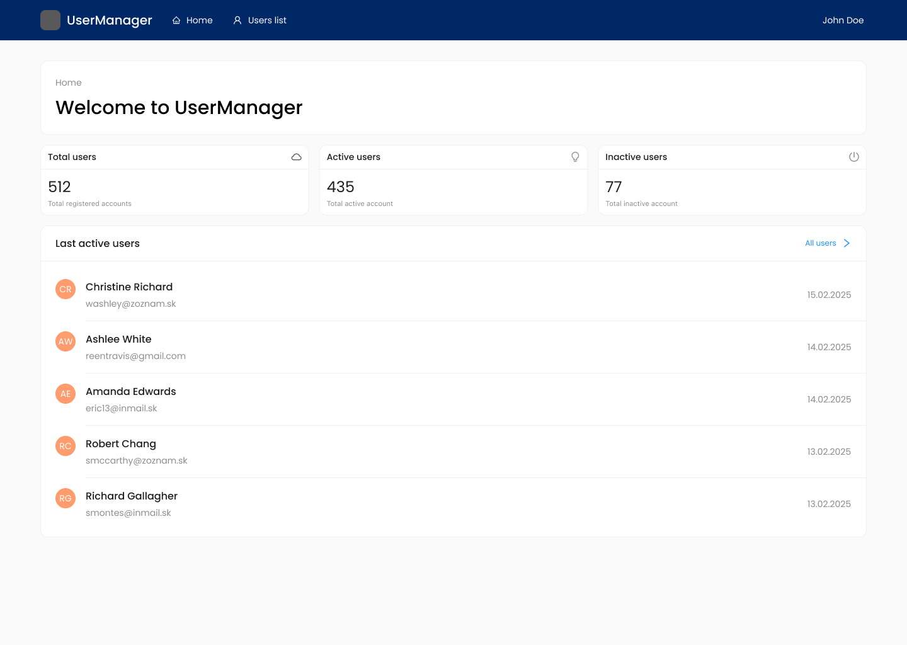

# Hilbi React Interview Task

- A full-stack React application for the Hilbi interview task, featuring a modern frontend and a mock backend server.
- This project is designed to assess your React, TypeScript, and frontend development skills.

---

## 👀 Project Overview

This is a **User Management System** built with React and TypeScript. The application helps manage users in a credit balance system.

---

## ✅ What's Already Set Up For You

```
hilbi-react-interview-task/
├── public/                # Static assets and manifest
├── server/                # Mock backend API (Express)
│   ├── app.js             # Main server file
│   ├── package.json       # Server dependencies
│   └── data/
│       └── users.js       # Example user data
├── src/                   # Frontend source code (React + TypeScript)
│   ├── assets/            # Static assets (images, etc.)
│   ├── components/        # Reusable UI components (buttons, forms, etc.)
│   ├── hooks/             # Custom React hooks
│   ├── integrations/      # Integration configs (i18n, TanStack Query, etc.)
│   ├── layouts/           # Layout components
│   ├── locales/           # Localization files
│   ├── routes/            # App routes (React Router)
│   ├── styles/            # Global and modular styles
│   ├── types/             # TypeScript types
│   ├── main.tsx           # App entry point
│   └── ...
├── package.json           # Frontend dependencies & scripts
├── tsconfig.json          # TypeScript config
├── vite.config.ts         # Vite config
└── README.md
```

- **React 19** with TypeScript
- **Vite** for fast development and builds
- **TanStack Router** for advanced routing
- **TanStack Query** for data fetching and caching
- **Ant Design (antd)** and **Tailwind CSS** for UI
- **Ant Design Icons** for prepared icons
- **i18next** for internationalization
- **Vitest** and **Testing Library** for testing
- **Prettier** and **ESLint** for code quality
- **Mock Express server** with Swagger docs for API

### UI & Tailwind CSS & CSS

This project uses [Ant Design (antd)](https://ant.design/), [Tailwind CSS](https://tailwindcss.com/) and CSS Modules (SCSS) for building the UI.

#### Tailwind Prefix

To avoid class name conflicts with Ant Design and other libraries, all Tailwind CSS classes in this project are prefixed with `tw:`.

**Example:**

```jsx
<div className="tw:flex tw:items-center tw:gap-2">...</div>
```

Make sure to use the `tw:` prefix for all Tailwind classes in your components.

#### SCSS & CSS Modules

In addition to Tailwind, this project supports modular and component-scoped styles using SCSS and CSS Modules.

**Usage:** Import SCSS module files directly into your React components:

```tsx
import styles from './base-layout.module.scss'
;<div className={styles.container}>...</div>
```

This approach helps prevent style conflicts and keeps component styles maintainable.

### Router Configuration

This project uses [TanStack Router](https://tanstack.com/router) for advanced routing. The main router configuration is located in `src/routes/routes.tsx`.

- **Route Definitions:**
  - All application routes are defined in `src/routes/routes.tsx` using TanStack Router's declarative API.
  - Nested routes and layouts are supported for modular structure.
- **Code Splitting:**
  - The router is configured for automatic code splitting, so only the code for the current route is loaded.
- **Route Tree Generation:**
  - The file `src/routeTree.gen.ts` is auto-generated to optimize route handling and should not be edited manually.
- **Devtools:**
  - Router devtools are available for debugging and can be enabled in development mode.

For more details, see the comments in `src/routes/routes.tsx` and the [TanStack Router documentation](https://tanstack.com/router/docs).

---

## 🎯 **Your Tasks**

### Task 1: Create a Dashboard (Homepage)



**Objective**: Implement a dashboard based on the provided design in figma file (`docs/hilbi.fig`).

**Requirements**:

- Display welcome message with breadcrumbs
- Display key statistics (total users, active users, inactive users)
- Show a "Last active users" section with 5 latest registered **active** users
  - this section should include a quick action to go to the list page
- Match the design and layout shown in the mockup
- Fetch real data from the API endpoints (real data might differ from values in design mockup)

### Task 2: Users Table with Filtering

**Objective**: Create a users page with a table that allows filtering by state. Design is up to you.

**Requirements**:

- Display all users in a table format
- Include relevant user information
  - full name, email, status, address, account balance, date of creation
- Implement filtering by status placed above the table
  - store filter state in query params
- Make sure the table can handle large data sets

---

### ℹ️ Your Freedom

While we've provided a solid foundation, **you're free to:**

- Install and use any libraries you prefer
- Modify the existing code structure if needed
- Add your own components, utilities, or helpers
- Choose your preferred working style (patterns and approaches)

### 🔍 **What We're Looking For**

- Correctness of your solution
- Performance
- Clean, readable, and maintainable code
- Proper TypeScript usage
- Effective use of React patterns
- Good component structure and separation of concerns
- Error handling and loading states
- Attention to detail in matching the design

You're not expected to finish everything, but it's better to do less and properly than to do more and poorly.

### 📝 **Notes**

- **TypeScript**: You'll need to create your own type definitions by examining the API responses
- **Data**: The server contains realistic mock data
- **Time**: Focus on code quality, proper TypeScript usage, and clean component architecture
- **Questions**: Feel free to ask questions about requirements or clarifications

---

## 🚀 **Getting Started**

### 💻 **Client** (`/src` folder)

#### 1. Install dependencies

```bash
npm install
```

#### 2. Start the frontend (React app)

```bash
npm run dev
```

The frontend runs on [http://localhost:3000](http://localhost:3000) by default.

### 🖥️ **Server** (`/server` folder)

#### 3. Start the backend server (API)

In a separate terminal:

```bash
cd server
npm install
npm start
```

The backend runs on [http://localhost:50000](http://localhost:50000) by default.
Swagger API docs: [http://localhost:50000/api-docs](http://localhost:50000/api-docs)

---

## 📤 **How to Submit Your Solution**

⚠️ **Important**: Do NOT push your changes to our original repository. You must create your own repository for your solution.

1. **Create your own repository**:
	 - Create a **public repository** on either:
	 - **GitHub** (github.com)
	 - **Gitlab** (gitlab.com)

2. **Set up your working repository**:

   ```bash
   # After cloning our repository and making your changes
   git remote remove origin
   git remote add origin https://github.com/your-username/your-repo-name.git
   # (or your Azure DevOps URL)

   # Squash all your work into a single commit
   git add .
   git commit -m "Complete interview tasks: Dashboard and Users table with filtering"
   git push -u origin main
   ```

3. **Submit the link**:
	- Review your work carefully and send us the **public** repository URL to interviews@hilbi.com.
		- Make sure the repository is accessible without authentication
	- If we didn't talk beforehand
		- In the subject line, write: Your Name - I want join Hilbi
		- In the email body, tell us why you want to work with us, list your top 3 strengths or skills, and attach your CV.

We'll get back to you soon - and if you made it this far, you're already just one step away from joining a global product. 🌍

Good luck! 🚀

# hilbi-assignment
